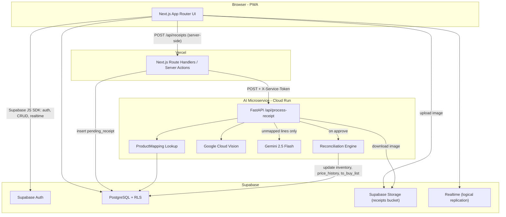
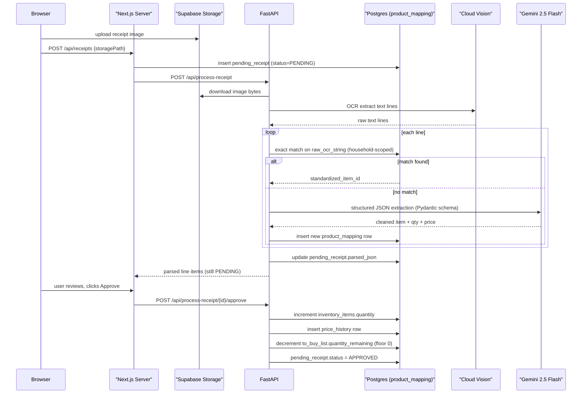

# G-rocery: Smart Inventory & Procurement System — Core Architecture Plan

## 0. Current State

Workspace `/Users/harold.santos/Personal Project` is empty — this is a greenfield build. No prior code, no `.cursor/` folder existed here before this plan file. (Unrelated legacy plan files found at the user-home `.cursor/plans/` level reference a different "Grocery" app on a Spring Boot/Vite stack — not applicable to this project and disregarded.)

## 1. Resolved Decisions (from clarifying questions)

| Decision | Choice |
|---|---|
| Multi-tenancy | Shared households: `households` + `household_members` (role: `OWNER`/`MEMBER`), RLS via `is_household_member()` |
| Repo layout | Single monorepo, two independently deployable services |
| Deploy targets | Next.js → Vercel; FastAPI → **Google Cloud Run** (Dockerfile) — approved, keeps compute in the same GCP project as Vision/Gemini |
| Receipt image flow | Storage-relay: browser uploads to Supabase Storage directly → Next.js server route creates `pending_receipt` + calls FastAPI with the storage path → FastAPI pulls the image server-side |
| Tooling | `pnpm` (Next.js), `uv` (Python/FastAPI) |
| Provisioning | Plan includes full Supabase + GCP + Google AI Studio setup steps |

### Design addition — APPROVED

`ToBuyList` was referenced in the reconciliation rules but had no DDL in section 2. Added `to_buy_list` table (see §4.7) with `quantity_requested` (immutable demand) and `quantity_remaining` (mutable balance, decremented on partial receipt matches — never deleted until `remaining <= 0`). Confirmed by user.

### Deviations from default workspace stack rules (explicit, per your brief)

- Backend is **Python FastAPI**, not Java/Spring Boot — required for first-class Google Cloud Vision / Gemini SDK support. The Java/Spring Boot rules do not apply to this repo's AI service.
- Frontend is **Next.js (React)** — already satisfies the "ask Svelte vs React" rule since you explicitly specified it.
- Java quality-gate/testing rules (JaCoCo, Checkstyle, SonarQube) do not apply; Python/TS equivalents are used instead (pytest+coverage, ruff/mypy, Vitest/ESLint).

## 2. High-Level Architecture



### Sequence: receipt processing (lookup-first + Gemini fallback + reconciliation)



## 3. Monorepo Folder Layout

```text
g-rocery/
├── README.md
├── .gitignore
├── .env.example                          # root-level, documents shared vars (Supabase URL, service token)
├── docker-compose.yml                    # local orchestration: supabase (via CLI), ai-service
├── package.json                          # pnpm workspace root (optional turborepo)
├── pnpm-workspace.yaml
├── supabase/
│   ├── config.toml
│   ├── migrations/
│   │   ├── 0001_households.sql
│   │   ├── 0002_helper_functions.sql
│   │   ├── 0003_inventory_items.sql
│   │   ├── 0004_product_mapping.sql
│   │   ├── 0005_price_history.sql
│   │   ├── 0006_pending_receipt.sql
│   │   ├── 0007_to_buy_list.sql
│   │   ├── 0008_storage_buckets.sql
│   │   └── 0009_bootstrap_household.sql   # added during Phase 2 build — see §4.9
│   └── seed.sql
├── web/                                   # Next.js app
│   ├── package.json
│   ├── next.config.js                     # PWA config
│   ├── tailwind.config.ts
│   ├── postcss.config.js
│   ├── tsconfig.json
│   ├── middleware.ts                      # Supabase session refresh
│   ├── public/
│   │   ├── manifest.json
│   │   └── icons/
│   ├── app/
│   │   ├── layout.tsx
│   │   ├── page.tsx
│   │   ├── (auth)/
│   │   │   ├── login/page.tsx
│   │   │   └── signup/page.tsx
│   │   ├── (dashboard)/
│   │   │   ├── layout.tsx
│   │   │   ├── inventory/page.tsx
│   │   │   ├── to-buy/page.tsx
│   │   │   └── receipts/
│   │   │       ├── page.tsx
│   │   │       └── [id]/page.tsx
│   │   └── api/
│   │       ├── household/
│   │       │   └── bootstrap/route.ts     # idempotent — calls bootstrap_household() RPC (§4.9)
│   │       └── receipts/
│   │           ├── route.ts               # create pending_receipt + call FastAPI
│   │           └── [id]/approve/route.ts  # call FastAPI approve endpoint
│   ├── lib/
│   │   ├── supabase/
│   │   │   ├── client.ts                  # browser client
│   │   │   ├── server.ts                  # server component/action client
│   │   │   └── middleware.ts
│   │   ├── ai-service-client.ts            # server-only fetch wrapper w/ X-Service-Token
│   │   ├── types/database.types.ts         # `supabase gen types typescript`
│   │   └── hooks/
│   │       ├── useRealtimeInventory.ts
│   │       └── useToBuyList.ts
│   └── components/
│       ├── inventory/InventoryTable.tsx
│       ├── receipts/ReceiptUploadForm.tsx
│       └── to-buy/ToBuyList.tsx
└── ai-service/                            # FastAPI app
    ├── pyproject.toml                      # uv-managed
    ├── uv.lock
    ├── .python-version
    ├── Dockerfile
    ├── .env.example
    └── app/
        ├── main.py
        ├── core/
        │   ├── config.py                   # Pydantic Settings
        │   ├── logging.py                  # correlation-id aware
        │   └── security.py                 # X-Service-Token verification
        ├── api/v1/
        │   ├── routes_receipt.py           # /api/process-receipt, /approve, /reject
        │   └── deps.py
        ├── schemas/
        │   ├── receipt.py
        │   └── reconciliation.py
        ├── services/
        │   ├── ocr_service.py
        │   ├── product_mapping_service.py
        │   ├── gemini_service.py
        │   ├── reconciliation_service.py
        │   └── receipt_pipeline.py
        ├── clients/
        │   ├── supabase_client.py
        │   ├── vision_client.py
        │   └── gemini_client.py
        └── tests/
            ├── test_receipt_pipeline.py
            ├── test_reconciliation_service.py
            └── test_product_mapping_service.py
```

## 4. Database Schema (Supabase Postgres — SQL migrations)

Applied via Supabase CLI (`supabase migration new <name>` / `supabase db push`). All tables use `uuid` PKs (`gen_random_uuid()`), RLS enabled everywhere, household-scoped via a `SECURITY DEFINER` helper function.

### 4.1 `0001_households.sql`

```sql
create extension if not exists "pgcrypto";

create table households (
  id uuid primary key default gen_random_uuid(),
  name text not null,
  created_at timestamptz not null default now()
);

create type household_role as enum ('OWNER', 'MEMBER');

create table household_members (
  household_id uuid not null references households(id) on delete cascade,
  user_id uuid not null references auth.users(id) on delete cascade,
  role household_role not null default 'MEMBER',
  joined_at timestamptz not null default now(),
  primary key (household_id, user_id)
);

create index idx_household_members_user_id on household_members(user_id);

alter table households enable row level security;
alter table household_members enable row level security;
```

### 4.2 `0002_helper_functions.sql`

```sql
create or replace function is_household_member(target_household_id uuid)
returns boolean
language sql security definer stable
as $$
  select exists (
    select 1 from household_members
    where household_id = target_household_id and user_id = auth.uid()
  );
$$;

create or replace function is_household_owner(target_household_id uuid)
returns boolean
language sql security definer stable
as $$
  select exists (
    select 1 from household_members
    where household_id = target_household_id and user_id = auth.uid() and role = 'OWNER'
  );
$$;

create or replace function set_updated_at()
returns trigger language plpgsql
as $$
begin
  new.updated_at = now();
  return new;
end;
$$;

create policy households_select on households
  for select using (is_household_member(id));
create policy household_members_select on household_members
  for select using (is_household_member(household_id));
create policy household_members_owner_manage on household_members
  for all using (is_household_owner(household_id)) with check (is_household_owner(household_id));
```

### 4.3 `0003_inventory_items.sql`

```sql
create type priority_level as enum ('LOW', 'MEDIUM', 'HIGH');

create table inventory_items (
  id uuid primary key default gen_random_uuid(),
  household_id uuid not null references households(id) on delete cascade,
  standardized_name text not null,
  quantity numeric(10,2) not null default 0 check (quantity >= 0),
  unit_type text not null,
  category text,
  priority_tag priority_level not null default 'MEDIUM',
  min_threshold numeric(10,2) not null default 0 check (min_threshold >= 0),
  expiration_date date,
  created_at timestamptz not null default now(),
  updated_at timestamptz not null default now()
);

create index idx_inventory_items_household_id on inventory_items(household_id);
create index idx_inventory_items_household_name on inventory_items(household_id, standardized_name);

create trigger trg_inventory_items_updated_at
  before update on inventory_items for each row execute function set_updated_at();

alter table inventory_items enable row level security;

create policy inventory_items_select on inventory_items for select using (is_household_member(household_id));
create policy inventory_items_insert on inventory_items for insert with check (is_household_member(household_id));
create policy inventory_items_update on inventory_items for update using (is_household_member(household_id)) with check (is_household_member(household_id));
create policy inventory_items_delete on inventory_items for delete using (is_household_member(household_id));
```

### 4.4 `0004_product_mapping.sql`

```sql
create table product_mapping (
  id uuid primary key default gen_random_uuid(),
  household_id uuid not null references households(id) on delete cascade,
  raw_ocr_string text not null,
  standardized_item_id uuid not null references inventory_items(id) on delete cascade,
  created_at timestamptz not null default now()
);

-- explicit requirement: B-Tree index on raw_ocr_string
create index idx_product_mapping_raw_ocr_string on product_mapping using btree (raw_ocr_string);
create index idx_product_mapping_standardized_item_id on product_mapping(standardized_item_id);
-- data-integrity addition: prevent duplicate mappings within a household
create unique index uq_product_mapping_household_raw_string on product_mapping(household_id, raw_ocr_string);

alter table product_mapping enable row level security;

create policy product_mapping_select on product_mapping for select using (is_household_member(household_id));
create policy product_mapping_insert on product_mapping for insert with check (is_household_member(household_id));
create policy product_mapping_update on product_mapping for update using (is_household_member(household_id)) with check (is_household_member(household_id));
create policy product_mapping_delete on product_mapping for delete using (is_household_member(household_id));
```

### 4.5 `0005_price_history.sql`

```sql
create table price_history (
  id uuid primary key default gen_random_uuid(),
  household_id uuid not null references households(id) on delete cascade,
  item_id uuid not null references inventory_items(id) on delete cascade,
  price numeric(10,2) not null check (price >= 0),
  store_name text not null,
  date_purchased date not null,
  created_at timestamptz not null default now()
);

-- explicit requirement: composite B-Tree index on (item_id, date_purchased)
create index idx_price_history_item_date on price_history using btree (item_id, date_purchased);

alter table price_history enable row level security;

create policy price_history_select on price_history for select using (is_household_member(household_id));
create policy price_history_insert on price_history for insert with check (is_household_member(household_id));
-- append-only ledger: no update/delete policy by default
```

### 4.6 `0006_pending_receipt.sql`

```sql
create type receipt_status as enum ('PENDING', 'APPROVED', 'REJECTED');

create table pending_receipt (
  id uuid primary key default gen_random_uuid(),
  household_id uuid not null references households(id) on delete cascade,
  store_name text,
  parsed_json jsonb,
  status receipt_status not null default 'PENDING',
  raw_image_url text not null,
  created_at timestamptz not null default now(),
  updated_at timestamptz not null default now()
);

create index idx_pending_receipt_household_status on pending_receipt(household_id, status);

create trigger trg_pending_receipt_updated_at
  before update on pending_receipt for each row execute function set_updated_at();

alter table pending_receipt enable row level security;

create policy pending_receipt_select on pending_receipt for select using (is_household_member(household_id));
create policy pending_receipt_insert on pending_receipt for insert with check (is_household_member(household_id));
create policy pending_receipt_update on pending_receipt for update using (is_household_member(household_id)) with check (is_household_member(household_id));
```

### 4.7 `0007_to_buy_list.sql` (design addition — approved)

```sql
create type to_buy_status as enum ('OPEN', 'PARTIAL', 'FULFILLED', 'CANCELLED');

create table to_buy_list (
  id uuid primary key default gen_random_uuid(),
  household_id uuid not null references households(id) on delete cascade,
  item_id uuid not null references inventory_items(id) on delete cascade,
  quantity_requested numeric(10,2) not null check (quantity_requested > 0),
  quantity_remaining numeric(10,2) not null check (quantity_remaining >= 0),
  status to_buy_status not null default 'OPEN',
  created_at timestamptz not null default now(),
  updated_at timestamptz not null default now()
);

create index idx_to_buy_list_household_status on to_buy_list(household_id, status);
create index idx_to_buy_list_item_id on to_buy_list(item_id);

create trigger trg_to_buy_list_updated_at
  before update on to_buy_list for each row execute function set_updated_at();

alter table to_buy_list enable row level security;

create policy to_buy_list_select on to_buy_list for select using (is_household_member(household_id));
create policy to_buy_list_insert on to_buy_list for insert with check (is_household_member(household_id));
create policy to_buy_list_update on to_buy_list for update using (is_household_member(household_id)) with check (is_household_member(household_id));
create policy to_buy_list_delete on to_buy_list for delete using (is_household_member(household_id));
```

**Partial fulfillment rule:** `quantity_remaining` starts equal to `quantity_requested`. Each approved receipt line matched to `item_id` decrements `quantity_remaining -= min(quantity_remaining, matched_qty)` (floored at 0, row is never deleted). Status transitions: `OPEN` (remaining == requested) → `PARTIAL` (0 < remaining < requested) → `FULFILLED` (remaining == 0).

### 4.8 `0008_storage_buckets.sql`

**Refinement (amendment):** the naive `(storage.foldername(name))[1]::uuid` cast throws an `invalid_text_representation` runtime exception — not just a policy denial — if a user uploads to the bucket root (no folder) or with a malformed prefix, since `array[1]` on an empty array is `NULL`, and `NULL::uuid` is fine but a garbage non-UUID folder name is not. Wrapped the extraction in a `SECURITY DEFINER` helper with an exception handler so any malformed/rootless path resolves to `NULL` instead of erroring, and `is_household_member(NULL)` naturally evaluates to `false` (no row satisfies `household_id = NULL`) — the request is denied, not crashed.

```sql
insert into storage.buckets (id, name, public) values ('receipts', 'receipts', false)
  on conflict (id) do nothing;

-- convention: object path = "{household_id}/{uuid}.jpg"
-- null-safe: returns NULL (never raises) for rootless uploads or non-UUID folder fragments
create or replace function storage_object_household_id(object_name text)
returns uuid
language plpgsql
security definer
stable
as $$
declare
  folder_parts text[];
begin
  folder_parts := storage.foldername(object_name);
  if folder_parts is null or array_length(folder_parts, 1) is null then
    return null;
  end if;
  return folder_parts[1]::uuid;
exception when invalid_text_representation then
  return null;
end;
$$;

create policy receipts_storage_select on storage.objects
  for select using (bucket_id = 'receipts' and is_household_member(storage_object_household_id(name)));

create policy receipts_storage_insert on storage.objects
  for insert with check (bucket_id = 'receipts' and is_household_member(storage_object_household_id(name)));
```

### 4.9 `0009_bootstrap_household.sql` (added during Phase 2 build — RLS gap fix)

**Discovered while wiring the Phase 2 login flow:** `households` has no INSERT policy (§4.1/§4.2), and `household_members_owner_manage` (§4.2) requires `is_household_owner()` — which is false for *everyone* on a brand-new household, since no OWNER row exists yet. A normal RLS-scoped client (anon key + user session) can **never** create the first household/membership row; this isn't a bug in the RLS design, it's the expected consequence of "only an OWNER can manage members" with no bootstrap escape hatch. Fixed with the standard Supabase pattern: a narrowly-scoped `SECURITY DEFINER` RPC instead of handing the Next.js server a `SUPABASE_SERVICE_ROLE_KEY` (which would have widened the env var matrix in §7 beyond what was intended — service role stays `ai-service`-only).

```sql
create or replace function bootstrap_household(p_household_name text default 'My Household')
returns uuid
language plpgsql
security definer
set search_path = public
as $$
declare
  v_household_id uuid;
begin
  select household_id into v_household_id
  from household_members
  where user_id = auth.uid()
  limit 1;

  if v_household_id is not null then
    return v_household_id;
  end if;

  insert into households (name)
  values (p_household_name)
  returning id into v_household_id;

  insert into household_members (household_id, user_id, role)
  values (v_household_id, auth.uid(), 'OWNER');

  return v_household_id;
end;
$$;

revoke all on function bootstrap_household(text) from public;
grant execute on function bootstrap_household(text) to authenticated;
```

Scope is deliberately narrow: it only ever acts on `auth.uid()` (the caller), never an arbitrary `user_id`/`household_id` passed as an argument, so it can't be abused to join/create households for other users. Idempotent — a caller who already belongs to a household gets that `household_id` back, so it's safe to call on every login (see `web/app/api/household/bootstrap/route.ts` in §6).

**Verified** against a throwaway Postgres 15 container: direct `insert into households` as the `authenticated` role is rejected by RLS as expected; `bootstrap_household()` creates exactly one household + one `OWNER` row on first call; a second call for the same user returns the same `household_id` with no duplicate rows.

### Assumptions baked into schema (flag if wrong)

- `unit_type` / `category` are free-text (`text`), not enums/FK tables — simplest for MVP; can normalize later.
- `raw_ocr_string` always stores the **normalized** form (`" ".join(raw.strip().upper().split())`, applied in FastAPI per §5.3) — trailing/collapsed whitespace and casing differences between scans of the same product never cause a duplicate row or a missed lookup.
- `priority_tag` uses a 3-value enum (`LOW`/`MEDIUM`/`HIGH`) — not specified in the brief, inferred as reasonable default.
- `ProductMapping` and `PriceHistory` are household-scoped (denormalized `household_id` column) rather than purely global, since `standardized_item_id`/`item_id` already point to a household-owned `inventory_items` row — this keeps RLS a single-column check instead of a subquery join.

## 5. FastAPI AI Microservice — Structural Interfaces

### 5.1 Config (`app/core/config.py`)

```python
from pydantic_settings import BaseSettings

class Settings(BaseSettings):
    supabase_url: str
    supabase_service_role_key: str
    gcp_vision_credentials_json: str
    gemini_api_key: str
    ai_service_token: str  # shared secret validated against X-Service-Token header

    class Config:
        env_file = ".env"

settings = Settings()
```

### 5.2 Pydantic schemas (`app/schemas/receipt.py`)

```python
from datetime import date
from uuid import UUID
from typing import Literal
from pydantic import BaseModel, Field

class ReceiptLineItem(BaseModel):
    raw_text: str
    standardized_name: str
    quantity: float = Field(gt=0)
    unit_price: float = Field(ge=0)
    total_price: float = Field(ge=0)
    category: str | None = None
    matched_item_id: UUID | None = None
    matched_via: Literal["lookup", "gemini"]

class ParsedReceipt(BaseModel):
    store_name: str
    date_purchased: date
    line_items: list[ReceiptLineItem]

class ProcessReceiptRequest(BaseModel):
    pending_receipt_id: UUID
    household_id: UUID
    storage_path: str

class ProcessReceiptResponse(BaseModel):
    pending_receipt_id: UUID
    status: Literal["PENDING"]
    parsed: ParsedReceipt
    matched_via_lookup_count: int
    matched_via_gemini_count: int

class ApproveReceiptRequest(BaseModel):
    line_items: list[ReceiptLineItem]  # user-editable before commit

class ApproveReceiptResponse(BaseModel):
    pending_receipt_id: UUID
    status: Literal["APPROVED"]
```

### 5.3 Lookup-first pipeline (`app/services/receipt_pipeline.py`)

**Amendment — normalization before lookup/persist:** raw OCR output varies in casing and whitespace between scans of the *same* physical product (e.g. `"Org Milk  "` vs `"ORG MILK"`), which would otherwise miss the exact-match lookup and burn a Gemini call every time. A pure normalization function is applied to every line **before** the `product_mapping` lookup and **before** any insert into `product_mapping`, so the table only ever stores canonical keys.

```python
# app/core/text_utils.py
def normalize_ocr_string(raw: str) -> str:
    """Trim, uppercase, and collapse internal whitespace to a single space."""
    return " ".join(raw.strip().upper().split())
```

```python
async def process_receipt(req: ProcessReceiptRequest) -> ProcessReceiptResponse:
    image_bytes = await storage_client.download(req.storage_path)
    raw_lines = await ocr_service.extract_lines(image_bytes)

    line_items: list[ReceiptLineItem] = []
    lookup_hits = gemini_hits = 0

    for line in raw_lines:
        normalized_text = normalize_ocr_string(line.text)

        mapping = await product_mapping_service.find_exact_match(
            household_id=req.household_id, raw_ocr_string=normalized_text
        )
        if mapping is not None:
            line_items.append(build_line_item_from_mapping(line, mapping))
            lookup_hits += 1
            continue

        # only unmapped (post-normalization) lines burn Gemini tokens
        extracted = await gemini_service.extract_structured(normalized_text)
        item_id = await product_mapping_service.resolve_or_create_item(
            household_id=req.household_id, extracted=extracted
        )
        await product_mapping_service.persist_mapping(
            household_id=req.household_id, raw_ocr_string=normalized_text, item_id=item_id
        )
        line_items.append(build_line_item_from_gemini(line, extracted, item_id))
        gemini_hits += 1

    parsed = ParsedReceipt(store_name=..., date_purchased=..., line_items=line_items)
    await pending_receipt_repo.update_parsed_json(req.pending_receipt_id, parsed)

    return ProcessReceiptResponse(
        pending_receipt_id=req.pending_receipt_id,
        status="PENDING",
        parsed=parsed,
        matched_via_lookup_count=lookup_hits,
        matched_via_gemini_count=gemini_hits,
    )
```

### 5.4 Reconciliation engine (`app/services/reconciliation_service.py`)

```python
async def apply_line_item(line: ReceiptLineItem, household_id: UUID) -> None:
    await inventory_repo.increment_quantity(line.matched_item_id, line.quantity)
    await price_history_repo.insert(
        household_id=household_id,
        item_id=line.matched_item_id,
        price=line.unit_price,
        store_name=...,
        date_purchased=...,
    )

    open_entries = await to_buy_repo.find_open_or_partial(household_id, line.matched_item_id)
    remaining_qty = line.quantity
    for entry in open_entries:
        if remaining_qty <= 0:
            break
        applied = min(entry.quantity_remaining, remaining_qty)
        new_remaining = entry.quantity_remaining - applied
        new_status = (
            "FULFILLED" if new_remaining == 0
            else "PARTIAL"
        )
        await to_buy_repo.update_remaining(entry.id, new_remaining, new_status)
        remaining_qty -= applied
```

### 5.5 Endpoints (`app/api/v1/routes_receipt.py`)

```python
router = APIRouter(prefix="/api", dependencies=[Depends(verify_service_token)])

@router.post("/process-receipt", response_model=ProcessReceiptResponse)
async def process_receipt_endpoint(req: ProcessReceiptRequest): ...

@router.post("/process-receipt/{pending_receipt_id}/approve", response_model=ApproveReceiptResponse)
async def approve_receipt_endpoint(pending_receipt_id: UUID, req: ApproveReceiptRequest): ...

@router.post("/process-receipt/{pending_receipt_id}/reject")
async def reject_receipt_endpoint(pending_receipt_id: UUID): ...
```

- Retry with exponential backoff (`tenacity`) + timeout on all Vision/Gemini calls.
- `X-Correlation-ID` propagated from Next.js, logged via `structlog` contextvars.
- `verify_service_token` dependency checks `X-Service-Token` header against `settings.ai_service_token` — FastAPI is never called directly from the browser.

## 6. Next.js Frontend — Structural Interfaces

### 6.1 Supabase clients

```typescript
// lib/supabase/client.ts — browser (anon key, RLS-enforced)
export const supabaseBrowser = () => createBrowserClient<Database>(url, anonKey);

// lib/supabase/server.ts — server components/actions (cookie-based session, RLS-enforced)
export const supabaseServer = () => createServerClient<Database>(url, anonKey, { cookies });
```

### 6.2 AI service client (server-only, holds the shared secret)

```typescript
// lib/ai-service-client.ts
export async function processReceipt(payload: ProcessReceiptRequest) {
  return fetch(`${process.env.AI_SERVICE_URL}/api/process-receipt`, {
    method: "POST",
    headers: {
      "Content-Type": "application/json",
      "X-Service-Token": process.env.AI_SERVICE_TOKEN!,
      "X-Correlation-ID": crypto.randomUUID(),
    },
    body: JSON.stringify(payload),
  });
}
```

### 6.3 Realtime hook

```typescript
// lib/hooks/useRealtimeInventory.ts
export function useRealtimeInventory(householdId: string) {
  const [items, setItems] = useState<InventoryItem[]>([]);
  useEffect(() => {
    const channel = supabaseBrowser()
      .channel(`inventory:${householdId}`)
      .on("postgres_changes", { event: "*", schema: "public", table: "inventory_items", filter: `household_id=eq.${householdId}` }, handleChange)
      .subscribe();
    return () => { channel.unsubscribe(); };
  }, [householdId]);
  return items;
}
```

### 6.4 Route handler boundary

```typescript
// app/api/receipts/route.ts
export async function POST(req: Request) {
  const { storagePath, storeName } = await req.json();
  const supabase = supabaseServer();
  const { data: pendingReceipt } = await supabase
    .from("pending_receipt")
    .insert({ raw_image_url: storagePath, store_name: storeName })
    .select()
    .single();

  const aiResponse = await processReceipt({
    pending_receipt_id: pendingReceipt.id,
    household_id: pendingReceipt.household_id,
    storage_path: storagePath,
  });
  return Response.json(await aiResponse.json());
}
```

## 7. Environment Variables Matrix

| Variable | Location | Purpose |
|---|---|---|
| `NEXT_PUBLIC_SUPABASE_URL` | web (public) | Supabase project URL |
| `NEXT_PUBLIC_SUPABASE_ANON_KEY` | web (public) | Browser client, RLS-enforced |
| `AI_SERVICE_URL` | web (server-only) | FastAPI base URL |
| `AI_SERVICE_TOKEN` | web (server-only) + ai-service | Shared secret for service-to-service auth |
| `SUPABASE_URL` | ai-service | Same project URL |
| `SUPABASE_SERVICE_ROLE_KEY` | ai-service (secret) | Bypasses RLS for trusted backend writes |
| `GCP_VISION_CREDENTIALS_JSON` | ai-service (secret) | Service account key for Cloud Vision |
| `GEMINI_API_KEY` | ai-service (secret) | Google AI Studio key for Gemini 2.5 Flash |

## 8. Provisioning Steps

1. **Supabase**: create project at supabase.com → copy Project URL, `anon` key, `service_role` key → install Supabase CLI (`pnpm add -g supabase`) → `supabase init` → `supabase link --project-ref <ref>`.
2. **Google Cloud**: create/select GCP project → enable **Cloud Vision API** → create a service account with `Cloud Vision API User` role → download JSON key.
3. **Google AI Studio**: generate a **Gemini API key** (aistudio.google.com) scoped for Gemini 2.5 Flash.
4. **Cloud Run** (recommended FastAPI host, same GCP project as Vision): enable Cloud Run API, note region for later `gcloud run deploy`.
5. **Vercel**: link the `web/` folder as the project root for deployment; add all `NEXT_PUBLIC_*` and server env vars in Vercel project settings.
6. Populate `web/.env.local` and `ai-service/.env` from the two `.env.example` files — never commit real values.

## 9. Local Development Orchestration

- `supabase start` — spins up local Postgres/Auth/Storage/Realtime emulation via Docker.
- `cd ai-service && uv sync && uv run uvicorn app.main:app --reload --port 8000`.
- `cd web && pnpm install && pnpm dev` (port 3000).
- `docker-compose.yml` at root wraps `ai-service` only (Supabase local stack is managed by its own CLI, not docker-compose) — used mainly for parity testing before Cloud Run deploy.

## 10. Phased Implementation Roadmap & Verification Checklists

### Phase 0 — Provisioning & Repo Scaffolding
- Monorepo skeleton, pnpm workspace, `supabase/` initialized and linked.
- **Verify**: `supabase link` succeeds; `.env.example` files present in both `web/` and `ai-service/`; no secrets committed (`git grep -i "service_role\|api_key"` returns nothing in tracked files).

### Phase 1 — Database Schema & RLS
- Apply migrations 0001–0008.
- **Verify**: all 7 tables + `storage.buckets` row exist; RLS enabled on every table (`select relrowsecurity from pg_class where relname = 'inventory_items'` → `true`); two test auth users in different households cannot see each other's rows; deleting an `inventory_items` row cascades to `product_mapping`/`price_history`/`to_buy_list`; `\d product_mapping` shows btree index on `raw_ocr_string`; `\d price_history` shows composite index on `(item_id, date_purchased)`.

### Phase 2 — Next.js Auth + Household Bootstrap
- Signup/login pages, middleware session refresh, auto-create `households` + `household_members(OWNER)` row on first signup.
- **Status**: login page wired to `signInWithPassword` + `app/api/household/bootstrap/route.ts` (§4.9/§6); **signup page still pending** (login-only can't create brand-new Supabase Auth users — needs `signUp` flow); `(dashboard)` route protection (redirect unauthenticated users to `/login`) also still pending.
- **Verify**: new signup produces exactly one `households` row and one `OWNER` membership; session persists across page refresh; unauthenticated access to `(dashboard)` routes redirects to `/login`.

### Phase 3 — Inventory & To-Buy CRUD + Realtime
- CRUD pages for `inventory_items` and `to_buy_list`; Realtime subscription wired.
- **Verify**: RLS blocks cross-household reads (manual test with two accounts); a change made in one browser tab reflects in another tab within ~1s without manual refresh.

### Phase 4 — FastAPI Service Skeleton
- `ai-service` scaffolded with `uv`, health endpoint, config loading, Dockerfile, `verify_service_token` dependency.
- **Status**: `GET /api/ping` added as a temporary `verify_service_token`-protected smoke-test endpoint (superseded/removed once the real Phase 5/6 routes land); **Dockerfile still pending**.
- **Bug found + fixed during verification**: `verify_service_token`'s `x_service_token` header was originally `Header(...)` (required) — a *missing* header failed FastAPI's own request validation with `422` before the function body ran, instead of the intended `401`. Changed to `Header(default=None)` with an explicit `None` check, so missing and wrong tokens both return `401`.
- **Verify**: `uv run uvicorn app.main:app --reload`; `curl localhost:8000/health` → `200`; `curl localhost:8000/api/ping` with no token → `401`; with wrong token → `401`; with correct `X-Service-Token` → `200`. `docker build -t ai-service .` not yet run (no Dockerfile).

### Phase 5 — OCR + Lookup-First Pipeline
- Cloud Vision integration; `normalize_ocr_string()` applied before every lookup and every `product_mapping` insert; `product_mapping_service.find_exact_match` scoped by `household_id`.
- **Verify**: unit test with a mocked Vision response returns expected raw lines; a raw string already present in `product_mapping` resolves without invoking the Gemini client (assert via mock spy — zero calls); `normalize_ocr_string("  Org Milk  ")` and `normalize_ocr_string("ORG   MILK")` both equal `"ORG MILK"` and resolve to the **same** `product_mapping` row (no duplicate insert, no extra Gemini call on the second variant).

### Phase 6 — Gemini Structured Extraction Fallback
- Gemini 2.5 Flash call bound to the strict `ReceiptLineItem`/`ParsedReceipt` Pydantic schema for unmapped lines; new mapping persisted after resolution.
- **Verify**: an unmapped line produces JSON that validates against the Pydantic schema (no manual parsing/regex fallback); re-processing the identical raw string on a second receipt resolves via lookup only (no second Gemini call, confirmed via spy/log count).

### Phase 7 — Reconciliation Engine (Partial Fulfillment)
- `/approve` endpoint: inventory increment, `price_history` insert, `to_buy_list` decrement.
- **Verify** (core acceptance test from the brief): seed `to_buy_list` with `quantity_requested=3, quantity_remaining=3, status=OPEN`; approve a receipt line with `quantity=1` for the same item → assert `quantity_remaining=2`, `status=PARTIAL`, row **not deleted**; approve remaining `quantity=2` → `quantity_remaining=0`, `status=FULFILLED`.

### Phase 8 — End-to-End Receipt Upload UI
- Upload form → Storage → route handler → FastAPI `process-receipt` → review UI → approve.
- **Verify**: manual E2E with a real receipt photo; parsed line items render for review; after approval, inventory quantities, price history, and to-buy balances update and are visible via Realtime without a manual page reload.

### Phase 9 — PWA & Deployment
- `next-pwa`/manifest/service worker/offline fallback; deploy `web/` to Vercel, `ai-service/` to Cloud Run; CORS on FastAPI restricted to the Vercel domain; secrets set in both platforms.
- **Verify**: Lighthouse PWA audit passes installability; production E2E works; build output contains no `service_role` or `GEMINI_API_KEY` strings (`next build` output inspection).

## 11. Open Risks / Follow-ups

- `to_buy_list` schema (§4.7) — **approved**.
- Cloud Run for FastAPI hosting — **approved** (same GCP project as Vision/Gemini, single-cloud credential surface).
- Fuzzy/near-duplicate `raw_ocr_string` variants — **resolved**: `normalize_ocr_string()` (§5.3) applied before every lookup and insert, closing the whitespace/casing loophole.
- Storage folder-extraction cast on rootless uploads — **resolved**: `storage_object_household_id()` helper (§4.8) swallows `invalid_text_representation` and returns `NULL` instead of raising, so a malformed/rootless object path is denied by RLS rather than crashing the request.
- No admin/ops tooling (e.g. merging duplicate `inventory_items`, bulk-editing `product_mapping`) is in scope for this plan — flag if needed as a later phase.
- Note: normalization is case-uppercasing only — it does not fix true OCR misreads (e.g. `"0RG MILK"` with a zero) or semantic near-duplicates (e.g. `"ORGANIC MILK"` vs `"ORG MILK"`); those still fall through to Gemini by design, which is correct since they are genuinely different raw strings, not just whitespace/casing noise.
